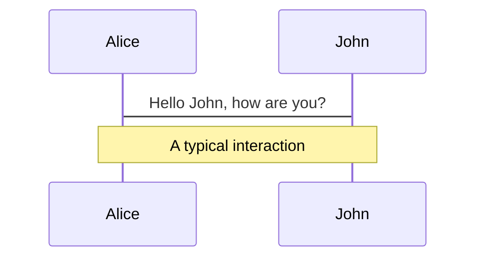
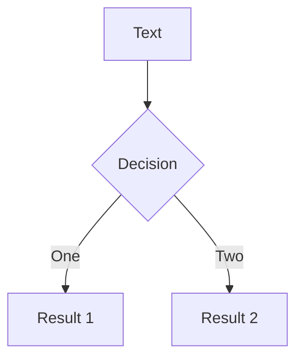
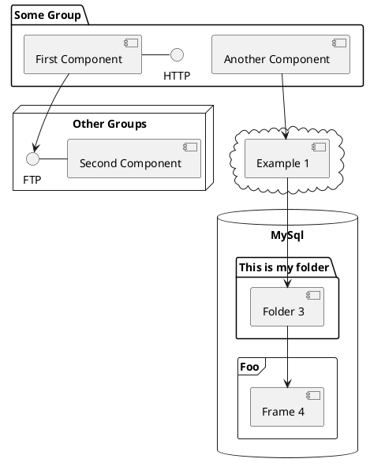

# Unveiling the Power of Headless Components in Vue

<div class="abs-br m-6 flex gap-2">
  <button @click="$slidev.nav.openInEditor()" title="Open in Editor" class="text-xl icon-btn opacity-50 !border-none !hover:text-white">
    <carbon:edit />
  </button>
  <a href="https://github.com/slidevjs/slidev" target="_blank" alt="GitHub"
    class="text-xl icon-btn opacity-50 !border-none !hover:text-white">
    <carbon-logo-github />
  </a>
</div>

<!--
The last comment block of each slide will be treated as slide notes. It will be visible and editable in Presenter Mode along with the slide. [Read more in the docs](https://sli.dev/guide/syntax.html#notes)
-->

---

# Table of Content?

We are going to review the following topics

- **Introduction**
- **What are headless components**
- **Real World Examples of HC**
- **Building a Headless component in Vue**
- **Pros and Cons**
- **Closing**
- **Resources** 

<!--
You can have `style` tag in markdown to override the style for the current page.
Learn more: https://sli.dev/guide/syntax#embedded-styles
-->

<style>
h1 {
  background-color: #2B90B6;
  background-image: linear-gradient(45deg, #4EC5D4 10%, #146b8c 20%);
  background-size: 100%;
  -webkit-background-clip: text;
  -moz-background-clip: text;
  -webkit-text-fill-color: transparent;
  -moz-text-fill-color: transparent;
}
</style>

---

# Introduction

Hover on the bottom-left corner to see the navigation's controls panel, [learn more](https://sli.dev/guide/navigation.html)

---

# Building a BareRate Component

```html {all|2|1-6|9|all}
// BareRate.vue
<template>
  <div>
    <slot
        v-for="current in range" 
        :key="current" 
        :current="current+1"
        :selected="isSelected(current+1)"
        :covered="isCovered(current+1)"
        :set-hovered="setHovered"
    >
        {{ current }}
    </slot>
  </div>
</template>
```

---

```html {all|5-8|10-14|15-22|23-25|27-30|all}
// BareRate.vue
<script setup>
import { ref, computed, reactive } from "vue";

const props = defineProps({
  modelValue: { type: Number },
  count: { type: Number }
});

const state = reactive({
  hoveredIndex: 0,
  range: computed(() => {
    return [...Array(props.count).keys()];
  }),
})

// state functions
function isCovered(current) {
  return props.modelValue >= current 
  || state.hoveredIndex.value >= current;
}

function isSelected(current) {
  return props.modelValue == current;
}

function setHovered(current) {
  state.hoveredIndex.value = current;
}
```

---

# Using our components

```html
<BareRate 
  v-model="rating" 
  :count="5" 
  class="space-x-2 cursor-pointer" 
  v-slot:default="{ selected, covered, current, setHovered }">
    <button 
      @click="rating=current" 
      @mouseover="setHovered(current)"
      @mouseout="setHovered(0)"
      class="font-bold text-gray-400 transition transform cursor-pointer hover:text-yellow-400 hover:scale-110" 
      :class="[(selected || covered) ? 'text-yellow-500': 'text-gray-400']"
    > 
      <i class="fa fa-star" > </i>
  </button>
</BareRate>
```

<!-- ./components/Rate.vue -->
<Rate />
---
class: px-20
---

# Using our components

```html
<BareRate 
  v-model="rating" 
  :count="5" 
  class="space-x-2 cursor-pointer" 
  v-slot:default="{ selected, covered, current, setHovered }">
    <BareRateButton 
      :current="current"
      class="font-bold text-gray-400 transition transform cursor-pointer hover:text-yellow-400 hover:scale-110" 
      :class="[(selected || covered) ? 'text-yellow-500': 'text-gray-400']"
    > 
      <i class="fa fa-star" > </i>
  </BareRatebutton>
</BareRate>
```

<!-- ./components/NewRate.vue -->
<NewRate />

---
class: px-20
---

# Themes

Slidev comes with powerful theming support. Themes can provide styles, layouts, components, or even configurations for tools. Switching between themes by just **one edit** in your frontmatter:

<div grid="~ cols-2 gap-2" m="-t-2">

```yaml
---
theme: default
---
```

```yaml
---
theme: seriph
---
```


</div>

Read more about [How to use a theme](https://sli.dev/themes/use.html) and
check out the [Awesome Themes Gallery](https://sli.dev/themes/gallery.html).

---
preload: false
---

# Animations

Animations are powered by [@vueuse/motion](https://motion.vueuse.org/).

```html
<div
  v-motion
  :initial="{ x: -80 }"
  :enter="{ x: 0 }">
  Slidev
</div>
```

<div class="w-60 relative mt-6">
  <div class="relative w-40 h-40">
    
    
    
  </div>

  <div
    class="text-5xl absolute top-14 left-40 text-[#2B90B6] -z-1"
    v-motion
    :initial="{ x: -80, opacity: 0}"
    :enter="{ x: 0, opacity: 1, transition: { delay: 2000, duration: 1000 } }">
    Slidev
  </div>
</div>

<!-- vue script setup scripts can be directly used in markdown, and will only affects current page -->
<script setup lang="ts">
const final = {
  x: 0,
  y: 0,
  rotate: 0,
  scale: 1,
  transition: {
    type: 'spring',
    damping: 10,
    stiffness: 20,
    mass: 2
  }
}
</script>

<div
  v-motion
  :initial="{ x:35, y: 40, opacity: 0}"
  :enter="{ y: 0, opacity: 1, transition: { delay: 3500 } }">

[Learn More](https://sli.dev/guide/animations.html#motion)

</div>

---

# LaTeX

LaTeX is supported out-of-box powered by [KaTeX](https://katex.org/).

<br>

Inline $\sqrt{3x-1}+(1+x)^2$

Block
$$
\begin{array}{c}

\nabla \times \vec{\mathbf{B}} -\, \frac1c\, \frac{\partial\vec{\mathbf{E}}}{\partial t} &
= \frac{4\pi}{c}\vec{\mathbf{j}}    \nabla \cdot \vec{\mathbf{E}} & = 4 \pi \rho \\

\nabla \times \vec{\mathbf{E}}\, +\, \frac1c\, \frac{\partial\vec{\mathbf{B}}}{\partial t} & = \vec{\mathbf{0}} \\

\nabla \cdot \vec{\mathbf{B}} & = 0

\end{array}
$$

<br>

[Learn more](https://sli.dev/guide/syntax#latex)

---

# Diagrams

You can create diagrams / graphs from textual descriptions, directly in your Markdown.

<div class="grid grid-cols-3 gap-10 pt-4 -mb-6">







</div>

[Learn More](https://sli.dev/guide/syntax.html#diagrams)


---
layout: center
class: text-center
---

# Learn More

[Documentations](https://sli.dev) · [GitHub](https://github.com/slidevjs/slidev) · [Showcases](https://sli.dev/showcases.html)
